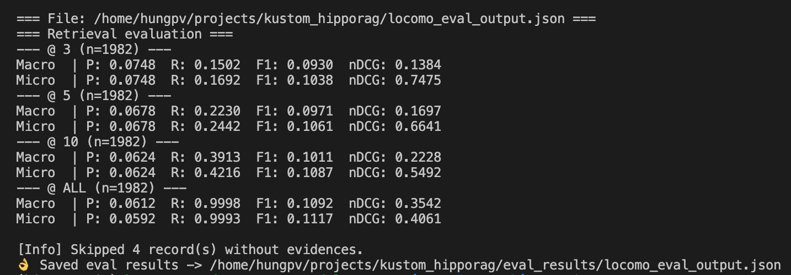

## Evaluation Guide


This document explains how to prepare retrieval outputs and evaluate HippoRAG on conversation datasets (e.g., LoCoMo).

### Pipeline Overview

First, download processed dataset from [this link](https://drive.google.com/drive/folders/1q4KAo-yCoi-53AeJ6GVCfykWQStkbCAO?usp=sharing)


1) Prepare retrieval data from a dataset using one of the scripts:
- index_hippo.py: DPR retrieval over original chunks.
- index_hippo_with_secom_segmentation.py: SeCom segmentation, DPR/graph over subchunks, map back to original chunks.

2) Evaluate the retrieval output using evaluator.py.

## Prerequisites

### Install dependencies
```bash
pip install -r requirements.txt
```

### Configure API access
If you run behind an OpenAI-compatible endpoint (e.g., vLLM):
```bash
export OPENAI_API_KEY="sk-"
export OPENAI_BASE_URL="http://localhost:8002/v1"
```

## Dataset format

Input is a JSON array of conversations. Each conversation contains conversation-level `chunks` and optional `questions`.
```json
[
  {
    "conv_id": "conversation-id",
    "chunks": [
      "chunk string...",
      { "content": "or dict-like chunk with content" }
    ],
    "questions": [
      {
        "question_id": "optional-id",
        "question_type": "optional-type",
        "question": "What did the user ask about?",
        "evidence": ["Supporting evidence chunks"],
        "category": 1
      }
    ]
  }
]
```

The scripts are permissive: when chunks are dicts, common keys like `chunk_content`, `content`, `text`, `raw`, `value` are checked.

## Script A: index_hippo.py (DPR over original chunks)

### What it does
- Loads the dataset and collects the conversation `chunks` as the corpus.
- Inserts all chunks directly into HippoRAG's passage embedding store (DPR only).
- For each `question`, runs DPR retrieval and writes a JSON array compatible with evaluator.py.

### CLI
```bash
python3 index_hippo.py \
  --input /path/to/dataset.json \
  --out /path/to/output.json \
  --save-dir outputs/run1 \
  --llm-base-url https://openrouter.ai/api/v1 \
  --llm-name gpt-4o-mini \
  --embedding-name BAAI/bge-m3 \
  --api-key $OPENAI_API_KEY \
  --top-k 10
```

Supported flags:
- --input: path to dataset JSON (required)
- --out: output JSON path (required)
- --save-dir: cache directory for HippoRAG storages (default: outputs/locomo)
- --llm-name: LLM name; also accepts -m/--model and env LLM_NAME; default gpt-4o-mini
- -m, --model: alias for --llm-name
- --llm-base-url: OpenAI-compatible base URL (default: https://openrouter.ai/api/v1)
- --embedding-name: embedding model (default: BAAI/bge-m3)
- --api-key: provider API key (exported to OPENAI_API_KEY)
- --embedding-api-key: separate key for embedding (falls back to --api-key)
- --top-k: number of DPR passages to retrieve (default: 10)
- --disable-thinking: no-op flag for compatibility; safely ignored

Tips:
- You can shorten `--llm-name` with `-m`, e.g., `-m Qwen/Qwen3-8B`.
- You can set `LLM_NAME` env var instead of passing `--llm-name`.

### Output format
Each record in the output JSON contains:
```json
{
  "conv_id": "conversation-id",
  "question_id": "synthesized-or-provided-id",
  "question_type": null,
  "question": "...",
  "evidences": ["..."],
  "category": 1,
  "retrieved": [{"chunk": "retrieved passage", "score": 0.85}],
  "chunks": ["original conversation chunks or dicts as-is"]
}
```

## Script B: index_hippo_with_secom_segmentation.py (SeCom + DPR/Graph)

### What it does
- Splits each original chunk into sentence-like exchanges.
- Uses SeCom.segment to produce topical subchunks per conversation.
- Indexes subchunks (and optionally original chunks) into HippoRAG.
- Retrieves on subchunks, aggregates scores back to their mother (original) chunks.
- Can use full HippoRAG graph (OpenIE) or pure DPR.
- Supports hierarchical retrieval (Stage-1 mothers, Stage-2 subchunks).

### CLI
```bash
python3 index_hippo_with_secom_segmentation.py \
  --input /path/to/dataset.json \
  --out /path/to/output.json \
  --save-dir outputs/secom_run1 \
  --llm-base-url http://localhost:8002/v1 \
  --llm-name Qwen/Qwen3-8B \
  --disable-thinking \
  --embedding-name BAAI/bge-m3 \
  --api-key $OPENAI_API_KEY \
  --top-k 10 \
  --pool-factor 10 \
  --agg sum \
  --graph \
  --window --window-size 5 --window-overlap 2 \
  --index-union \
  --hierarchical --mother-pool 50 --merge-reranker bm25 \
  --debug-jsonl /path/to/secom_debug.jsonl
```

Key flags (in addition to common flags like --input/--out/--llm-name/...):
- --pool-factor: multiply top-k for subchunk pool before mother aggregation (default: 10)
- --agg: aggregation strategy when mapping subchunks -> mothers; one of sum, mean, max (default: sum)
- --graph: use full HippoRAG graph over subchunks (OpenIE) instead of DPR-only
- --window, --window-size, --window-overlap: optional sliding-window augmentation over exchanges
- --index-union: index both original chunks and subchunks
- --hierarchical: Stage-1 retrieve mothers, Stage-2 rerank within mothers using subchunks/graph; final returns mothers
- --mother-pool: number of candidate mothers in Stage-1 (default: 50)
- --merge-reranker: reranker when merging mothers; choices: none, bm25 (default: none)
- --secom-config: path to SeCom config YAML (defaults to SeCom/secom/configs/mpnet.yaml)
- --debug-jsonl: write debug JSONL logs for segmentation/retrieval
- --disable-thinking: pass through into BaseConfig to disable provider thoughts where supported

Notes:
- When `--graph` is off, the script uses DPR-only over subchunks for speed.
- With `--hierarchical`, an additional DPR index is built over original chunks (mothers).

### Output format
Same as Script A. Even with subchunk processing, the `retrieved` list contains original chunks (mothers), so it is directly compatible with evaluator.py.

## Step 2: Run the evaluator

```bash
python3 evaluator.py \
  --input /path/to/retrieval_output.json \
  --ks 3,5,10,ALL \
  --precision-mode ir \
  --out-dir eval_results
```

The evaluator computes standard IR metrics (recall, precision, f1, ndcg, mrr) at specified cutoffs and can emit per-category breakdowns.

## Examples

### A. DPR over original chunks
```bash
python3 index_hippo.py \
  --input ./locomo_session_all.json \
  --out ./locomo_eval_output.json \
  --save-dir outputs/locomo \
  --llm-base-url http://localhost:8002/v1 \
  -m Qwen/Qwen3-8B \
  --embedding-name BAAI/bge-m3 \
  --api-key sk- \
  --top-k 10 \
  --disable-thinking
```

### B. SeCom segmentation + DPR/graph
```bash
python3 index_hippo_with_secom_segmentation.py \
  --input ./locomo_session_all.json \
  --out ./locomo_eval_output_secom.json \
  --save-dir outputs/locomo_secom \
  --llm-base-url http://localhost:8002/v1 \
  --llm-name Qwen/Qwen3-8B \
  --disable-thinking \
  --embedding-name BAAI/bge-m3 \
  --api-key sk- \
  --top-k 10 \
  --pool-factor 10 \
  --agg sum \
  --graph \
  --window --window-size 5 --window-overlap 2 \
  --index-union \
  --hierarchical --mother-pool 50 --merge-reranker bm25 \
  --debug-jsonl ./secom_debug.jsonl
```

### C. Evaluate
```bash
python3 evaluator.py \
  --input ./locomo_eval_output.json \
  --ks 3,5,10,ALL \
  --precision-mode ir \
  --out-dir eval_results
```

Example Result:


